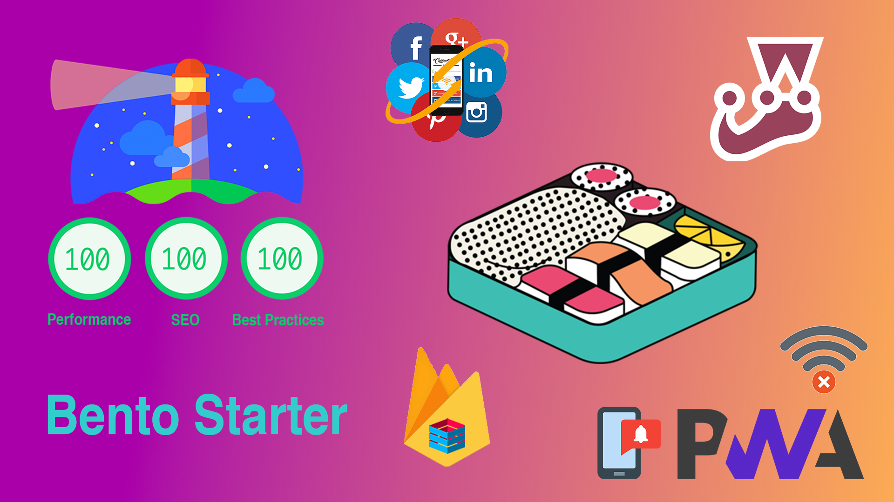

# Welcome to Bento



## Introduction

🍱 bento-starter is an Open-Source Full-Stack solution that helps you to build fast and maintainable web applications using tools like Vue.js, Firebase, Progressive Web Apps support, dynamic offline support... The goal of this project is to provide a powerfull and well configured stack (with CI/CD, hosting...) so you can focus on writing your web application very quickly.


### Tech Stack

* 🤘 Vue.js : front-end framework
* 🔧 Vue-cli : standard tooling for vue.js development
* 🔁 Vuex : state management
* 💾 Firestore : cloud NoSQL Database
* 🏠 Firebase hosting : fast and secure web hosting
* 👤 Firebase authentication : for easy authentication
* 📱 PWA : progressive web app support
* 💄 Prettier : code formatting rules
* 🚨 Eslint : control code quality
* ✅ Jest : unit testing
* ✅ Cypress : e2e testing
* 🔍 Vue head : meta description per page
* 📄 prerender spa plugin : pages prerendering
* 💚 circleci : continuous integration/deployment
* 📦 bundlesize : control your javascript bundles sizes

### App Features

* 👤 Google authentication
* 📴 Offline support (dynamic & static caching)
* 🆕 New version available prompt on new app deployments
* ➕ Add to home screen prompt for ios & android
* ↩️ Smart redirection for auth protected routes
* ✨ Products page example to demonstrate app data management with firestore and vuex
* 💪 Better PWA support for all browsers with PWACompat

## Setup

Pre-requisites

* node9.3.0+
* npm@5.5.0+

### Step 1 - Installation

🕙Estimated time → 20 seconds 

```
git clone https://github.com/kefranabg/bento-starter.git my-bento-project
cd my-bento-project

# Install dependencies and clean git repository
npm run setup
}
```
### Step 2 - Firebase configuration
🕙Estimated time → 3 minutes 

* Create a new firebase project with the firebase console

* Once your firebase project is created, add an application by clicking the Firebase web app button. Enter an app nickname but do not check "Also set up Firebase Hosting" and click next. Copy the firebaseConfig object and replace the config variable in '/src/firebase/init.js' in bento-starter project.

* Go to Side menu → Database → Create database and select Start in test mode. Now your firestore database is up.
* Go to Side menu → Authentication click Set up sign-in method.

* Click on Google provider, enable it by clicking the switch button, select a project support email and click save button. You will be able to change or add new auth providers later if you need to.

* Back to your bento-starter project, open a console and run :

```
npm i -g npx

# Login with the account you used to create the firebase project
npx firebase login

# Select the project you've just created and use "default" as alias
npx firebase use --add

# Build the app and deploy
npm run build
npx firebase deploy
}
```

You're done ! 🎉
Your project is now available on firebase hosting.